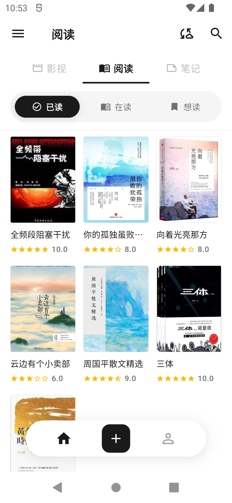
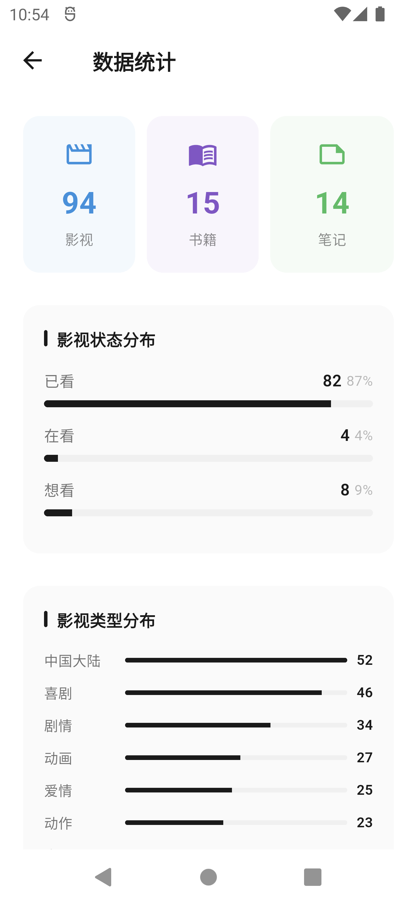
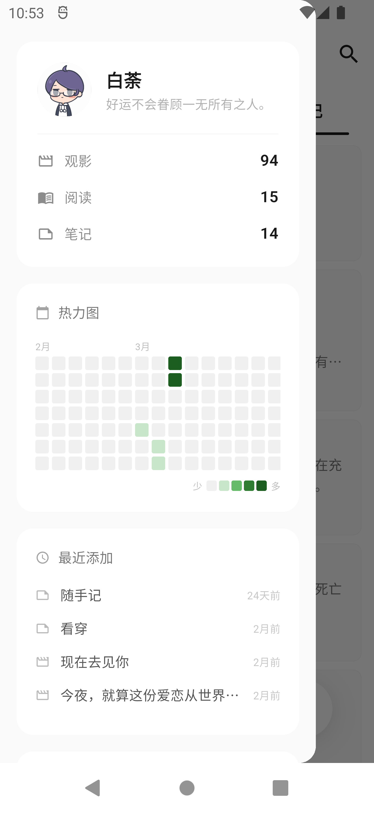
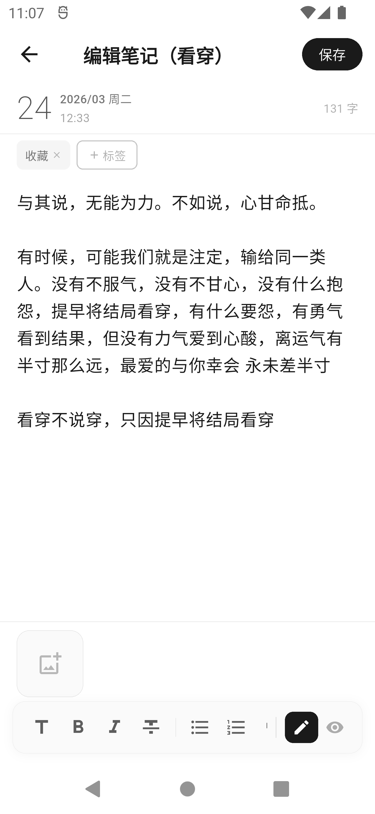
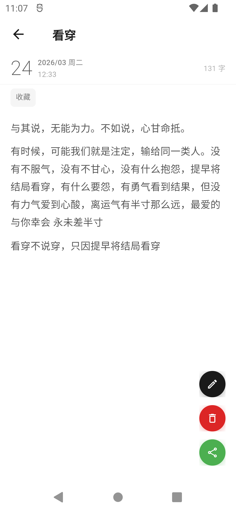

# MookNote

极简风格的观影 · 阅读 · 笔记 记录应用，基于 Flutter 开发。

官网：https://mooknote.iletter.top/

**开发计划：**

http://docmost.iletter.top/share/ropwljpyvn/p/mook-note-lHmPTswdDC

## 应用预览

|                 影视列表                 |                 书籍列表                 |                 笔记界面                 |
| :---------------------------------------: | :---------------------------------------: | :---------------------------------------: |
|  |  |  |

更多预览图片请到**应用功能详情预览**里面查看

## 功能特性

### 影视管理

- 影视增删改查，支持海报、导演、演员、类型等信息录入
- 影视分类：电影 / 电视剧 / 动漫 / 综艺 / 纪录片 / 短片
- 影评撰写与管理，支持短评与长评，星级评分
- 影视海报墙浏览（瀑布流布局），支持多张海报管理与全屏浏览
- 影视分享（生成海报名场面风格分享卡片）
- 豆瓣链接爬取，自动填充影视信息
- 影视状态筛选（想看 / 在看 / 已看）
- 在线搜索影视资源（服务端代理，支持分页）

### 书籍管理

- 书籍增删改查，支持封面、作者、出版社、ISBN 等信息
- 书评撰写与管理，支持短评与长评
- 书摘 / 摘录记录（按章节管理，支持批注）
- 书籍分享卡片
- 书籍状态筛选（想读 / 在读 / 已读）
- Epub 阅读功能（详见下方）
- 在线搜索书籍资源

### 笔记管理

- 笔记增删改查，支持 Markdown 编辑与实时渲染
- 笔记置顶功能
- 多种列表布局：列表 / 瀑布流 / 时间线
- 笔记分享卡片
- Markdown 阅读器支持暗色模式与字体大小调节

### Note Plus（块级编辑器）

- 类 Notion 的块级富文本编辑器，基于 flutter_quill
- 支持 10 种块类型：段落、标题（H1-H3）、无序列表、有序列表、待办清单、引用、代码块、分隔线
- 行内格式：粗体、斜体、下划线、删除线、行内代码
- 斜杠命令菜单（输入 `/` 唤出）
- 树形文档结构，支持嵌套层级与拖拽排序
- 独立标签页管理

### Epub 阅读器

- 基于 WebView 的 Epub 渲染引擎
- 目录导航抽屉
- 阅读进度追踪与记录
- 脚注弹窗、图片全屏查看
- 音量键翻页
- 自定义阅读样式（字体大小、主题等）
- 书架管理（网格展示，文件选择器导入）
- 书籍元数据编辑

### Markdown 阅读器

- 本地文件系统浏览与目录过滤
- Markdown 文件渲染查看

### 通用功能

- 全局搜索（影视 / 书籍 / 笔记）+ 在线搜索
- 标签管理与分类（影视类型 / 书籍类型 / 笔记标签统一管理）
- 数据统计与可视化图表（总览、状态分布、类型雷达图、导演 / 作者 Top 5）
- 媒体日历（按日期查看影视 / 书籍添加记录，展示封面缩略图）
- 人物列表（汇总所有导演、编剧、演员、作者，关联其作品）
- 随机漫步（随机回顾影视 / 书籍 / 笔记内容）
- 与你相遇（使用天数、总记录数、字数、图片数统计）
- 回收站（软删除，可恢复影视、书籍、笔记、影评、书评）
- 服务器同步与 WebDAV 云同步（支持上传 / 下载 / 双向同步 / 定时自动同步）
- 本地备份与恢复（zip 归档，支持定时自动备份）
- 暗色 / 亮色 / 跟随系统主题切换
- 6 套配色方案 + Android 12+ Monet 动态取色
- 4 款内置中文字体（霞鹜文楷、OPPO Sans、思源宋体、得意黑）
- 自定义应用图标（3 款可选）
- 更新日志查看
- 用户使用统计（可选）

## 技术栈

| 类别       | 技术                                   |
| ---------- | -------------------------------------- |
| 框架       | Flutter 3.5+                           |
| 语言       | Dart                                   |
| 状态管理   | Provider                               |
| 本地数据库 | SQLite（sqflite）                      |
| 图表       | fl_chart                               |
| 富文本     | flutter_quill（Note Plus）             |
| Markdown   | flutter_markdown_plus                  |
| WebView    | webview_flutter / flutter_inappwebview |
| 后端       | Python Flask（服务端 API 与管理后台）  |

## 项目结构

```
lib/
├── main.dart                      # 应用入口，初始化与后台任务
├── models/
│   ├── data_models.dart           # 数据模型（Movie, Book, Note, Review, Poster, Excerpt）
│   └── note_plus_models.dart      # Note Plus 模型（Block, Document）
├── providers/
│   ├── app_provider.dart          # 全局状态管理（Provider）
│   └── note_plus_provider.dart    # Note Plus 文档状态
├── pages/
│   ├── movies/                    # 影视相关页面（列表、表单、详情、影评、海报、分享）
│   ├── book/                      # 书籍相关页面（列表、表单、详情、书评、书摘、分享）
│   ├── note/                      # 笔记相关页面（列表、表单、详情、分享）
│   ├── note_plus/                 # Note Plus 块级编辑器页面
│   ├── epub_reader/               # Epub 阅读器（渲染、目录、控制、脚注、图片查看）
│   ├── markdown_reader/           # Markdown 文件浏览与查看
│   ├── online_search/             # 在线搜索影视书籍
│   ├── sync/                      # 同步与备份页面（云同步、WebDAV、本地备份）
│   ├── home_page.dart             # 首页
│   ├── main_content_page.dart     # 主内容页（影视 / 书籍 / 笔记 / Note Plus 标签页）
│   ├── profile_page.dart          # 个人中心
│   ├── statistics_page.dart       # 数据统计页
│   ├── recycle_bin_page.dart      # 回收站
│   ├── tag_management_page.dart   # 标签管理
│   ├── encounter_page.dart        # 与你相遇（使用统计）
│   ├── stroll_page.dart           # 随机漫步
│   ├── media_calendar_page.dart   # 媒体日历
│   ├── person_list_page.dart      # 人物列表
│   ├── changelog_page.dart        # 更新日志
│   └── app_icon_picker_page.dart  # 应用图标选择
├── utils/
│   ├── database_helper.dart       # SQLite 数据库管理（版本 25，含迁移链）
│   ├── movie/                     # 影视 DAO（movie, review, poster）
│   ├── book/                      # 书籍 DAO（book, review, excerpt）
│   ├── note/                      # 笔记 DAO
│   ├── note_plus/                 # Note Plus DAO
│   ├── tag/                       # 标签 DAO
│   ├── epub/                      # Epub 解析、渲染、阅读设置
│   ├── sync/                      # 同步服务（WebDAV / 本地备份 / 自动备份）
│   ├── theme/                     # 主题配置（6 套配色 + Monet + 暗色 / 亮色）
│   ├── app_router.dart            # 路由生成器
│   ├── user_prefs.dart            # 用户偏好设置
│   ├── server_config.dart         # 服务端地址配置
│   └── image_path_helper.dart     # 图片路径管理
└── widgets/                       # 通用组件（列表项、评分、导航栏、抽屉、骨架屏等）
    └── note_plus/                 # Note Plus 编辑器组件（工具栏、块渲染、斜杠菜单）

server/                            # Python Flask 后端
├── app.py                         # 服务入口
├── admin_api.py                   # 管理 API
├── auth.py                        # 认证模块
├── sync_api.py                    # 同步 API
├── web_ui.py                      # Web 管理后台
└── static/                        # 静态资源（Vditor、Chart.js）
```

## 数据存储

- **数据存储位置**：`/mooknote/mooknote.db`
- **图片存储位置**：`/mooknote/images/<类别>/<条目ID>/<文件名>`
  - 类别：`movie` / `book` / `note`
- **书籍存储位置**：`/mooknote/epub_book/<条目ID>/书籍.epub`

## 环境要求

- Flutter SDK 3.5+
- Dart SDK 3.5+
- Android SDK（API 21+）

## 快速开始

```bash
# 克隆项目
git clone https://github.com/dellevin/mooknote.git
cd mooknote

# 安装依赖
flutter pub get

# 运行
flutter run
```

如果 `pub get` 失败，可尝试设置临时变量的国内镜像：

```bash
$env:PUB_HOSTED_URL="https://pub.flutter-io.cn"
$env:FLUTTER_STORAGE_BASE_URL="https://storage.flutter-io.cn"
flutter pub get
```

或者使用代理方式：

```bash
# 如果失败可以先添加代理再进行get，ip和端口号自行更改
$env:HTTP_PROXY="http://127.0.0.1:10808"
$env:HTTPS_PROXY="http://127.0.0.1:10808"
flutter pub get
```

## 构建

```bash
# 构建 Release APK
flutter build apk --release

# 构建 App Bundle（Google Play）
flutter build appbundle --release
```

## 应用功能详情预览

|                 数据统计                 |                 侧边栏                 |                 我的界面                 |
| :---------------------------------------: | :-------------------------------------: | :---------------------------------------: |
|  |  |  |

|                 详情界面1                 |                 详情界面2                 |                 编辑笔记                 |
| :----------------------------------------: | :----------------------------------------: | :---------------------------------------: |
|  |  |  |

|                 分享界面1                 |                 分享界面2                 |                 预览笔记                 |
| :----------------------------------------: | :----------------------------------------: | :---------------------------------------: |
|  |  |  |

## 影视书籍资源数据对接

数据已对接 6w+ 影视基础数据，以及 300w+ 书籍基础信息，如需对接接口，或技术交流请联系作者。所有影视书籍来源皆为网络资源收集，部分数据可能会有偏差，如数据有问题，也请联系开发者及时修复

## 开源协议

本项目采用 [AGPL-3.0](https://www.gnu.org/licenses/agpl-3.0.html) 开源协议。

## 致谢

**[lumina](https://github.com/MilkFeng/lumina)**

**[NLCISBNPlugin](https://github.com/DoiiarX/NLCISBNPlugin)**
